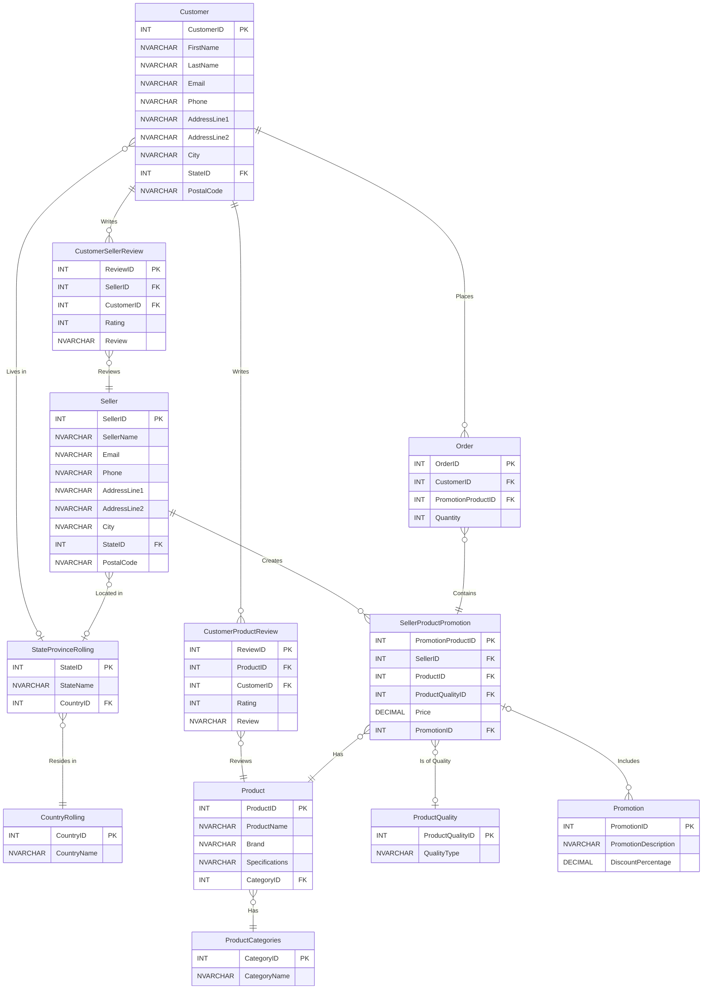

# **abcretail**

## **A Data Lake House Project**

## Project GitHub Link

This project can be found on GitHub [here](https://github.com/midha-abhishek/abcretail/tree/main).

## **Technologies Involved**

- **GitHub** for:
	- *`Continuous-Integration/Continuous-Deployment (CI/CD)`*
	- **HTTP API** Replication
	- Important Project Documents
- **Microsoft Entra ID** with:
	- **Azure Default Directory** application for *`Service Principal`*
- **Azure Key Vault** for:
	- *`Service Principal`*
	- Storing other secrets, passwords and credentials
- **Azure SQL Database** with **Azure SQL Server**
- **Microsoft SQL Server** with:
	- **Microsoft SQL Server Management Studio**
	- **Microsoft SQL Server Configuration Manager**
	- **ANSI SQL**
	- **DBeaver** for the *`ER Diagram`*
	- **Microsoft Integration Runtime**
	- **Windows Firewall**
- **Azure Data Lake Gen2 Storage Account**
- **Azure Data Factory**
- **Azure Databricks** with
	- **PySpark**
	- **Delta Tables**
- **Azure Synapse Analytics** with
	- *`Serverless Database Pool`*
	- **Transact-SQL**

## **Abstract**

This is what the project schematics look like:


This project uses ***GitHub*** for *`Continuous-Integration/Continuous-Deployment (CI/CD)`* throughout its course. For each major development change, a new `dev` branch was created, and for final testing, a separate `qa` branch was used with its own environment setup.

For security, *`Service Principal`* was used with the combination of ***Microsoft Entra ID*** with ***Azure Default Directory App*** and ***Azure Key Vault*** was used. ***Azure Key Vault*** was also used to store other important secrets, passwords and credentials.

*`Dynamic`* links, triggers, datasets, data flows and other pipeline activities were used wherever permissible to avoid hard coding. They were *`tested`* thoroughly with the required credentials.

The project involves data ingestion from multiple sources:

- ***HTTP API*** with JSON softline product data
- ***Azure SQL Database***
- On-Premise ***Microsoft SQL Server***

> [!Note]
>
> **GitHub HTTP API Replication**
> 
> To replicate the HTTP API, I created and uploaded the JSON documents to GitHub, which can be found [here](https://github.com/midha-abhishek/abcretail/tree/main/softline_data). I used their direct raw HTTP links to pull data.
> 
> The direct links to the JSON files are here:
> 
> - [accessories.json](https://raw.githubusercontent.com/midha-abhishek/abcretail/refs/heads/main/softline_data/accessories.json)
> - [clothing.json](https://raw.githubusercontent.com/midha-abhishek/abcretail/refs/heads/main/softline_data/clothing.json)
> - [footwear.json](https://raw.githubusercontent.com/midha-abhishek/abcretail/refs/heads/main/softline_data/footwear.json)
> - [home_decor.json](https://raw.githubusercontent.com/midha-abhishek/abcretail/refs/heads/main/softline_data/home_decor.json)

The *`raw`* data from the various sources is then stored in the "raw" container of the ***Azure Data Lake Storage Gen2 Account*** using ***Azure Data Factory*** pipeline.

**`Lookup`**, **`Foreach`** and **`Switch`** activities are used to automate the dynamic pipeline for each dataset and data source.

> [!Note]
>
> **Lookup JSON Document**
> 
> A JSON document (lookup.json) was created and uploaded to the "metadata" container of the Storage Account with all the datasets and their respective sources. A sample of this document can be found [here](https://raw.githubusercontent.com/midha-abhishek/abcretail/refs/heads/main/metadata/lookup/lookup.json).

The JSON raw data are stored first as it is using the **`Copy data`** activity, and then as CSV using the `Data flow` to ensure that the nested objects and arrays are saved properly under their respective CSV headers.

**`Copy data`** activity is also used for the raw data ingestion from the **Azure SQL Database*** and ***Microsoft SQL Server*** as `parquet` formats.

Using *`PySpark`* in an ***Azure Databricks*** cluster, the raw data is then cleaned and stored in *`Delta Tables`* onto the "curated" container of the Storage Account.

With another **Databricks** cluster, ***`ETL`*** is performed on the Delta Tables (as per the business case scenario). The transformed Delta Tables are stored in the "staging" container.

The two ***Azure Databricks*** clusters are incorporated into the ***Azure Data Factory*** pipeline, and the parameterized pipeline is again automated using a **`trigger`** that runs at the end of each day (at 08:00 pm) with the respective values for each parameter.

***Azure Synapse Analytics*** with a `Serverless Database Pool` is used to create external tables from the Delta Tables in the curated and staging containers of the Storage Account.

Using *`Transac-SQL (T-SQL)`* in the ***Azure Synapse Analytics***, a thorough analysis was performed on the available data from the various sources.

## **Methodology**

### 1 — **On-Premise Microsoft SQL Server Database Setup**

On a new ***Microsoft SQL Server*** sample database was created using ***Microsoft SQL Server Management Studio*** with `SQL Server Authentication` credentials. The DDL could be found [here](https://raw.githubusercontent.com/midha-abhishek/abcretail/refs/heads/main/onprem_sql_server/onprem_abcretail_ddl.sql).

#### 1.1 — **DDL From the Normalized Database**

Here's what the sample code from the DDL looks like:

```sql
CREATE TABLE Customer (
	CustomerID INT IDENTITY(1,1) PRIMARY KEY,
	FirstName NVARCHAR(50),
	LastName NVARCHAR(50),
	Email NVARCHAR(100),
	Phone NVARCHAR(15),
	AddressLine1 NVARCHAR(200),
	AddressLine2 NVARCHAR(200),
	City NVARCHAR(100),
	StateID INT FOREIGN KEY REFERENCES StateProvinceRolling(StateID),
	PostalCode NVARCHAR(20)
);

INSERT INTO Customer (FirstName, LastName, Email, Phone, AddressLine1, AddressLine2, City, StateID, PostalCode)
VALUES
	('John', 'Doe', 'john.doe@example.com', '1234567890', '123 Main St', '', 'Toronto', 1, 'M5H 2N2'),
	('Jane', 'Smith', 'jane.smith@example.com', '9876543210', '456 Elm St', '', 'Los Angeles', 4, '90001');

SELECT * FROM Customer;
```

#### 1.2 — **ER Diagrams**

Here's the detailed `ER Diagram`:



Here's the output `ER Diagram` as visualized in ***DBeaver***:


### 2 — **HTTP API — GitHub Replication Setup**

To replicate an HTTP API with softline product datasets, ***GitHub*** was used.

Some sample JSON datasets were created and uploaded to the ***GitHub*** Repository, which were later accessed through their raw links. The information about the data has been provided above.

### 3 — **Service Principal and Azure Key Vault Setup**

Created an **Azure Default Directory*** application using ***Microsoft Entra ID***, and then created a `client secret`.

Used ***Azure Key Vault*** in an ***Azure Resource Group*** to store the following credentials:
- `Client ID`, also known as `Application ID` and `Service Principal ID`
- `Directory ID`, also known as `Tenant ID`
- `Client Secret`
- Self-hosted on-premise `Microsoft SQL Server Authentication Password`

### 4 — **Azure Data Lake Gen2 Storage Account Setup**

Created an ***Azure Data Lake Gen2 Storage Account*** with the following `Blob Storage Containers`:

- metadata
- raw
- curated
- staging

Under ***IAM Access Control***, appropriate roles were assigned to the ***Azure Default Directory*** application to give other resources (such as ***Azure Data Factory***, ***Azure Databricks*** and ***Azure Synapse Analytics***) required access through the `Service Principal`.

### 5 — **Azure SQL Database with SQL Server Setup**

An ***Azure SQL Database*** with ***SQL Server*** and a `sample` dataset was created. The password credentials were stored in the ***Azure Key Vault***.

### 6 — **Lookup File Setup**

Since the ***Azure Data Factory*** pipelines would be parameterized for reusability and modular purposes, a `lookup` JSON document was created to include all the datasets with their sources.  The file was uploaded to the `metadata` container. The link to the sample file has been provided above.

This is what a part of the JSON document looks like:

```json
{
	"source": "onprem_sqlserver",
	"filename": "Seller"
},
```

### 7 — **Azure Data Factory Setup**

An ***Azure Data Factory*** resource was created in the ***Resource Group***, and linked to the ***GitHub*** Repository. The principles of `Continuous Integration/Continuous Development (CI/CD)` were followed throughout the development and testing process. For each stage of the development, testing and deployment, ***GitHub*** Repository branches were created and used. Each stage was tested thoroughly under separate environments and conditions.

The ***Azure Data Factory*** was given access to the ***Azure Key Vault*** credentials through ***Key Vault*** `Access Policies`. At the same time, the access was created for ***AzureDatabricks*** for later use.

All the linked services, integration runtime environment, datasets, data flow and pipelines were parameterized and created dynamically.

Linked services for the following resources were created:

- **Azure Key Vault**
- **Azure Data Lake Gen2 Storage Account**
- **HTTP API — JSON** (**GitHub**)
- **Azure SQL Database**
- **Microsoft SQL Server** (`Selfhosted` *Integration Runtime Environment*)

While creating the Selfhosted ***Microsoft SQL Server*** linked service, an integration runtime was also created and linked to an on-premise ***Microsoft Integration Runtime***.

A linked service for ***Databricks*** was created later on.

A trigger was created (but not started, since no pipeline attached yet) to run at the end of each day at 08:00 pm.

#### 7.1 — **Azure Data Factory Initial Pipeline Setup**


To handle data from multiple sources, a **`Lookup`** activity was used with a loopup.json file on the `metadata` container of the Storage account, as mentioned.

To go through the array output, **`Foreach`** activity was used with a **`Switch`** activity. **`Foreach`** data source, the **`switch`** statement would run certain activities.


For the JSON data from the ***HTTP API***, two sequenced parameterized activities were used:

- A **`Copy data`** activity to simply copy the JSON data as it is.
- A **`Data flow`** to ensure that the nested objects and arrays were saved properly under their `CSV` headers.


For the hardline datasets from both the ***Azure SQL Database*** and on-premise, self-hosted ***Microsoft SQL Server***, **`Copy data`** activities were used to ingest data in the `parquet` format.

The default activity was left to **`Wait`** for 1 second.


### 8 — **Azure Databricks  — Data Cleaning Cluster Setup**

An ***Azure Databricks*** resource was created in the ***Resource Group***. An `access token` was created in the settings, and a linked service in the ***Azure Data Factory*** for later use.

A `secret scope` was created to access the credentials from the ***Azure Key Vault****.

A notebook was created to clean the raw data from various sources. The notebook could be accessed [here](https://github.com/midha-abhishek/abcretail/blob/main/databricks/data_cleaning.ipynb).

The cleaned data was stored in `Delta Tables` on the "curated" Blob Storage Container of the Data Lake Storage.

#### 8.1 — **Azure Databricks — Data Cleaning Cluster  and ADF Pipeline Integration**

A **`Databricks Notebook`** activity was used to automate the process of data cleaning at the end of each pipeline run.


### 9 — **Azure Databricks — ETL Cluster**

Another ***Databricks*** Notebook was created for the business case `ETL (Extract, Transform and Load)`. The data was extracted from the Delta Tables on the "curated" container of the Storage Account,  transformed as per the business use cases, and loaded in the `Delta Tables` onto the "staging" container. The notebook could be found [here](https://github.com/midha-abhishek/abcretail/blob/main/databricks/etl_business_case.ipynb).

### 10 — **Complete Azure Data Factory Pipeline with Databricks Clusters**

The **`ETL`** ***Azure Databricks*** notebook was also added to the ***Azure Data Factory*** pipeline.


### 11 — Azure Synapse Analytics Integration

An ***Azure Synapse Analytics*** resource was created in the ***Azure Resource Group***, and access to the ***Key Vault*** was granted through the ***Key Vault*** **`Access Policies`** for the `Service Principal` credentials.

Parameterized dynamic linked services for the ***Key Vault*** and  ***Data Lake Storage Account*** were created.

A `serverless` database pool was created.

Used `T-SQL` to create external tables for al the datasets from various sources available on the "curated" and "staging" Delta Tables. The DDL could be found [here](https://raw.githubusercontent.com/midha-abhishek/abcretail/refs/heads/main/azure_synapse_analytics/sqlscript/external_tables_ddl.sql).

Then performed thorough analysis on the available data using [aggregated functions](https://raw.githubusercontent.com/midha-abhishek/abcretail/refs/heads/main/azure_synapse_analytics/sqlscript/analysis_aggregation_dql.sql) and [joins](https://raw.githubusercontent.com/midha-abhishek/abcretail/refs/heads/main/azure_synapse_analytics/sqlscript/analysis_joins_dql.sql). Then performed some [advanced analysis](https://raw.githubusercontent.com/midha-abhishek/abcretail/refs/heads/main/azure_synapse_analytics/sqlscript/analysis_advanced_dql.sql).

Here's a sample of some of the advanced analyses performed:

```sql
-- Top 5 Products by Total Sales Revenue

SELECT TOP 5 p.Name AS ProductName, 
	SUM(sod.LineTotal) AS TotalRevenue,
	COUNT(DISTINCT soh.SalesOrderID) AS NumberOfSales
FROM [azsqldb_Product] p
JOIN [azsqldb_SalesOrderDetail] sod ON p.ProductID = sod.ProductID
JOIN [azsqldb_SalesOrderHeader] soh ON sod.SalesOrderID = soh.SalesOrderID
WHERE soh.Status = 5  -- 5 indicates completed orders
GROUP BY p.Name
ORDER BY TotalRevenue DESC;
```

```sql
-- Year-Over-Year Sales Growth

WITH SalesByYear AS (
	SELECT YEAR(OrderDate) AS SalesYear, 
		SUM(TotalDue) AS TotalSales
	FROM [azsqldb_SalesOrderHeader]
	WHERE OrderDate IS NOT NULL
	GROUP BY YEAR(OrderDate)
)
SELECT SalesYear, 
	TotalSales, 
	LAG(TotalSales, 1) OVER (ORDER BY SalesYear) AS LastYearSales,
	((TotalSales - LAG(TotalSales, 1) OVER (ORDER BY SalesYear)) / LAG(TotalSales, 1) OVER (ORDER BY SalesYear)) * 100 AS SalesGrowthPercentage
FROM SalesByYear
ORDER BY SalesYear;
```

## **Pipeline Monitoring and Troubleshooting Measures**

- **`Monitor logs`** for the **Data Factory** pipeline runs were checked thoroughly for detailed activity logs and error messages.
- Used ***ADF*** **`Debug`** mode to test individual activities, and checked for runtime errors.
- Ensured that the TCP/UDP ports for the ***Microsoft SQL Server*** were properly configured in the ***Firewall***.
- The on-premise server was ensured to be available most of the time so that the data is available and accessible when needed.
- Pipeline parameters and credentials were ensured to be entered correctly.
- Data formats in the `Copy data` and `Data flow` activities were ensured to match properly.
- Ensure no mismatch between the source and sink schema for consistent mapping.
- Ensured that the **`Integration Runtime`** and **`Service Principal`** credentials were configured correctly.
- Conditional statements and error handling were used in the ***Databricks*** **`Notebooks`** to handle day-to-day activities.
- Adjusted the ***Databricks*** cluster size to handle larger workloads.
- Analyzed ***Databricks*** job and cluster logs for detailed error information. Used ***Databricks*** monitoring tools for real-time insights.

